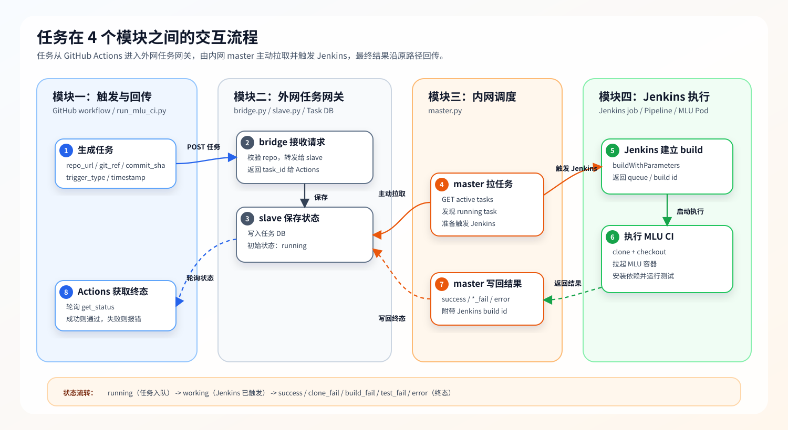

# SGLang MLU CI/CD 整体方案说明

本文档描述当前 SGLang MLU CI/CD 的整体实现方案、部署边界、执行流程和安全注意事项。当前方案采用外网/DMZ 与内网分离的 pull-based bridge 模式：外部只负责提交任务和查询状态，内部主动拉取任务并触发 Jenkins，避免将 Jenkins、MLU 集群和内部资源暴露到公司外部网络。

## 1. 设计目标

当前设计主要满足以下目标：

- GitHub Actions 可以触发 SGLang MLU CI。
- 公司外部环境不能直接访问 Jenkins、MLU 集群、内部镜像仓库、内部模型路径等资源。
- 公司内网可以主动访问外网/DMZ 的任务队列。
- Jenkins 凭据只保存在内网侧，不出现在外网侧配置中。
- CI 任务的提交、执行和状态回传可以形成闭环。

核心思路是：

```text
外部提交任务，内部主动拉取任务，Jenkins 只在内网被访问。
```


## 2. 模块划分

从业务职责和部署边界看，当前方案可以划分为 4 个模块：

| 模块 | 主要文件/组件 | 部署位置 | 核心职责 |
| --- | --- | --- | --- |
| 触发与回传模块 | GitHub workflow、`scripts/ci/mlu/invoke_mlu_ci.sh`、`scripts/ci/mlu/run_mlu_ci.py` | GitHub Actions runner | 收集 GitHub 事件上下文，提交 MLU CI 任务，轮询任务状态，并将最终结果反馈到 GitHub Actions |
| 外网任务网关模块 | `vps/bridge.py`、`vps/slave.py`、`vps/external_ci.conf` | 外网或 DMZ Runner/VPS | 对外接收任务，维护任务队列和状态数据库，为 GitHub Actions 和内网 master 提供任务状态接口 |
| 内网调度模块 | `internal/master.py`、`internal_master.conf` | 公司内网 | 主动从外网/DMZ 拉取待处理任务，触发 Jenkins job，轮询 Jenkins build，并把 Jenkins 结果写回任务队列 |
| Jenkins 执行模块 | `jenkins/jenkins_sglang.pipeline`、Jenkins job、MLU Pod | Jenkins / MLU 内部环境 | clone 指定代码版本，申请 MLU 资源，拉起测试镜像，安装 SGLang，并执行 MLU 测试套件 |

四个模块之间的关系是：

```text
触发与回传模块
  -> 外网任务网关模块
  <- 内网调度模块
  -> Jenkins 执行模块
```

也可以理解为两条链路：

- 任务提交链路：GitHub Actions -> bridge.py -> slave.py。
- 任务执行链路：master.py -> slave.py -> Jenkins -> MLU Pod -> slave.py。

## 2.1 任务跨模块交互流程图

下图描述一个 CI 任务在 4 个模块之间的流转过程，包括任务创建、入队、内网调度、Jenkins 执行、结果回写和 GitHub Actions 获取终态。



### 2.2 各阶段功能说明

1. 生成任务
   - 所属模块：触发与回传模块。
   - 主要组件：GitHub workflow、`invoke_mlu_ci.sh`、`run_mlu_ci.py`。
   - 功能内容：在 GitHub Actions 中读取触发事件，整理仓库地址、分支、commit SHA、PR ID、触发类型等信息，生成标准 CI 任务 payload。
   - 输入：GitHub event、`GITHUB_REF`、`GITHUB_SHA`、PR 信息。
   - 输出：CI 任务 payload。

2. 提交任务
   - 所属模块：触发与回传模块 -> 外网任务网关模块。
   - 主要组件：`run_mlu_ci.py`、`bridge.py`。
   - 功能内容：GitHub Actions 通过 HTTP POST 将任务提交到外网/DMZ 的 bridge；bridge 做基础校验，例如仓库名是否为 `sglang`。
   - 输入：CI 任务 payload。
   - 输出：bridge 接收到的任务请求。

3. 任务入队
   - 所属模块：外网任务网关模块。
   - 主要组件：`bridge.py`、`slave.py`、任务 DB。
   - 功能内容：bridge 将任务转发给 slave；slave 生成 `task_id`，将任务以 `running` 状态写入 JSON DB，并把 `task_id` 返回给 GitHub Actions。
   - 输入：任务请求。
   - 输出：`task_id`、`status=running`。

4. 状态轮询
   - 所属模块：触发与回传模块 -> 外网任务网关模块。
   - 主要组件：`run_mlu_ci.py`、`bridge.py`、`slave.py`。
   - 功能内容：GitHub Actions 周期性查询任务状态；bridge 代理查询 slave；在任务未完成时持续等待。
   - 输入：`task_id`。
   - 输出：`running`、`working` 或终态状态。

5. 内网拉取任务
   - 所属模块：内网调度模块 -> 外网任务网关模块。
   - 主要组件：`master.py`、`slave.py`。
   - 功能内容：内网 master 主动访问外网/DMZ 的 slave，获取 active task；这个方向符合“内网可以访问外网，外网不能访问内网”的安全模型。
   - 输入：active task 查询请求。
   - 输出：待处理任务列表。

6. 触发 Jenkins
   - 所属模块：内网调度模块 -> Jenkins 执行模块。
   - 主要组件：`master.py`、Jenkins API。
   - 功能内容：master 获取 Jenkins crumb，并调用 `buildWithParameters` 触发 Jenkins job；传入 `repo_url`、`git_ref`、`commit_sha`、`task_id`、`trigger_type` 等参数。
   - 输入：待处理任务。
   - 输出：Jenkins queue item / build id。

7. 更新运行中状态
   - 所属模块：内网调度模块 -> 外网任务网关模块。
   - 主要组件：`master.py`、`slave.py`。
   - 功能内容：master 拿到 Jenkins build id 后，将任务状态更新为 `working`，并把 build id 写入 `inner_id`，便于后续追踪 Jenkins build。
   - 输入：Jenkins build id。
   - 输出：`status=working`、`inner_id=<build_id>`。

8. Jenkins 执行测试
   - 所属模块：Jenkins 执行模块。
   - 主要组件：Jenkins job、`jenkins_sglang.pipeline`、MLU Pod。
   - 功能内容：Jenkins pipeline clone 指定代码版本，申请 MLU 资源，拉起 MLU 容器，安装 SGLang MLU 依赖，并执行对应测试套件。
   - 输入：Jenkins 参数、代码仓库、MLU 镜像。
   - 输出：Jenkins build result、测试日志。

9. 结果分类与回写
   - 所属模块：内网调度模块 -> 外网任务网关模块。
   - 主要组件：`master.py`、`slave.py`。
   - 功能内容：master 轮询 Jenkins build 状态；build 完成后根据 Jenkins result 和失败阶段分类为 `success`、`clone_fail`、`build_fail`、`test_fail`、`error` 等，并写回 slave。
   - 输入：Jenkins build result。
   - 输出：任务终态和日志摘要。

10. GitHub Actions 收敛
    - 所属模块：触发与回传模块。
    - 主要组件：`run_mlu_ci.py`。
    - 功能内容：GitHub Actions 轮询到终态后打印日志；成功状态返回 0，失败状态返回 1；随后调用 `end_job` 清理任务。
    - 输入：任务终态。
    - 输出：GitHub Actions 成功或失败。

阶段之间的状态流转如下：

```text
任务生成
  -> 提交到 bridge
  -> slave 入队 running
  -> master 拉取任务
  -> Jenkins 触发成功，状态变为 working
  -> Jenkins 执行 MLU CI
  -> master 写回 success / *_fail / error
  -> GitHub Actions 获取终态并结束 workflow
```

这样划分后，各模块的安全边界比较清晰：

- GitHub Actions 只需要知道外网 `bridge.py` 地址。
- 外网任务网关模块不保存 Jenkins 凭据，也不直接访问 Jenkins。
- 内网调度模块是唯一访问 Jenkins API 的中间层。
- Jenkins 执行模块只在内网运行，负责真正的 MLU CI 执行。

## 3. 目录结构

当前实现放在 `/extend/sgl-dev/sglang-poc` 目录下，结构如下：

```text
./
  README.md

  vps/
    README.md
    common.py
    bridge.py
    slave.py
    external_ci.conf
    deploy_vps.sh

  internal/
    README.md
    common.py
    master.py
    internal_master.conf
    deploy_master.sh
    verify_chain.sh
    docs/

  jenkins/
    README.md
    jenkins_sglang.pipeline
```

各目录职责如下：

| 目录 | 部署位置 | 职责 |
| --- | --- | --- |
| `vps/` | 外网或 DMZ | 接收 GitHub Actions 请求，保存任务状态 |
| `internal/` | 公司内网 | 主动轮询任务，触发 Jenkins，回写结果 |
| `jenkins/` | Jenkins job 配置 | 定义实际 MLU CI 执行逻辑 |
| `vps/common.py` / `internal/common.py` | VPS 和内网各自使用 | 公共配置、HTTP JSON 响应、URL 处理等工具函数 |

## 4. 总体架构

整体架构如下：

```text
GitHub Actions
    |
    | 1. 提交 CI 任务 / 查询任务状态
    v
外网/DMZ: bridge.py
    |
    | 2. 转发任务 / 查询状态
    v
外网/DMZ: slave.py
    ^
    |
    | 3. 内网 master 主动轮询任务、回写状态
    |
内网: master.py
    |
    | 4. 触发 Jenkins job / 轮询 Jenkins build
    v
内网: Jenkins job
    |
    | 5. 拉起 MLU 容器，执行 SGLang MLU 测试
    v
MLU K8s / 内部镜像仓库 / 内部模型资源
```

结果回传路径：

```text
Jenkins build 结果
  -> master.py
  -> slave.py
  -> bridge.py
  -> GitHub Actions
```

该方案中，外网不会主动访问内网 Jenkins，Jenkins 也不需要暴露给 GitHub Actions。

## 5. 组件职责

### 5.1 GitHub Actions 侧

GitHub workflow 负责在 PR、push、nightly 或手动触发时启动 MLU CI 请求。

相关文件通常包括：

```text
.github/workflows/pr-test-mlu.yml
.github/workflows/nightly-test-mlu.yml
scripts/ci/mlu/invoke_mlu_ci.sh
scripts/ci/mlu/run_mlu_ci.py
```

主要行为：

1. 收集 GitHub 上下文，例如仓库、分支、PR ID、commit SHA。
2. 生成 CI 任务 payload。
3. 向外网/DMZ 的 `bridge.py` 提交任务。
4. 持续轮询任务状态。
5. 根据最终状态决定 GitHub Actions 成功或失败。

### 5.2 bridge.py

部署位置：

```text
vps/bridge.py
```

职责：

- 作为 GitHub Actions 可访问的 HTTP 入口。
- 接收任务提交请求。
- 校验仓库名，例如只接受 `sglang`。
- 将任务转发给 `slave.py`。
- 代理 GitHub Actions 的 `get_status` 和 `end_job` 请求。

`bridge.py` 不访问 Jenkins，也不保存 Jenkins user/token。

### 5.3 slave.py

部署位置：

```text
vps/slave.py
```

职责：

- 作为任务队列和状态存储。
- 接收 `bridge.py` 写入的新任务。
- 接收 `master.py` 的状态更新。
- 提供 active task 查询接口给 `master.py`。
- 提供任务状态查询接口给 `bridge.py`。

任务状态保存在 JSON DB 中，由 `vps/external_ci.conf` 中的 `db_path` 指定。

常见状态包括：

| 状态 | 含义 |
| --- | --- |
| `running` | 任务已提交，等待 master 处理 |
| `waiting` | Jenkins job 已提交，但暂未拿到 build id |
| `working` | Jenkins build 已经启动，正在运行 |
| `success` | Jenkins build 成功 |
| `clone_fail` | clone 或 checkout 阶段失败 |
| `build_fail` | 构建或安装阶段失败 |
| `test_fail` | MLU 测试阶段失败 |
| `unstable` | Jenkins 返回 UNSTABLE |
| `error` | Jenkins 触发失败、被中止或内部错误 |

### 5.4 master.py

部署位置：

```text
internal/master.py
```

职责：

- 运行在内网。
- 主动轮询外网/DMZ 的 `slave.py`。
- 获取待处理任务。
- 使用 Jenkins API 触发 Jenkins job。
- 轮询 Jenkins build 结果。
- 将 Jenkins build id 和最终状态写回 `slave.py`。

`master.py` 是整个中间 runner 中唯一和 Jenkins 通信的组件。

它访问的 Jenkins API 包括：

```text
GET  /crumbIssuer/api/json
POST /job/.../buildWithParameters
GET  /queue/item/<id>/api/json
GET  /job/.../<build_id>/api/json
GET  /job/.../api/json
```

Jenkins 凭据建议通过环境变量提供：

```bash
export SGLANG_JENKINS_USER='<jenkins-user>'
export SGLANG_JENKINS_TOKEN='<jenkins-api-token>'
```

### 5.5 Jenkins pipeline

部署位置：

```text
jenkins/jenkins_sglang.pipeline
```

职责：

- clone 指定 SGLang 仓库。
- checkout 指定 commit SHA、分支或 PR ref。
- 申请 MLU 资源。
- 拉取 MLU CI 镜像。
- 安装 SGLang MLU 依赖。
- 运行 MLU 测试。
- 归档日志。

当前使用的 MLU CI 镜像为：

```text
yellow.hub.cambricon.com/cambricon_pytorch_container/cambricon_pytorch_container:v26.04.0-torch2.11.0-torchmlu1.32.2-ubuntu22.04-py310
```

## 6. 详细执行流程

### 6.1 GitHub Actions 提交任务

GitHub Actions 运行 `scripts/ci/mlu/invoke_mlu_ci.sh`，该脚本会调用：

```text
scripts/ci/mlu/run_mlu_ci.py
```

提交到 bridge 的 payload 示例：

```json
{
  "timestamp": "1780910000000",
  "repo": "sglang",
  "pr_id": "",
  "repo_url": "https://github.com/chenxb002/sglang.git",
  "git_ref": "<待测试的 SGLang 代码分支，例如 ci-poc>",
  "commit_sha": "d7f43113828f7de7a0f335ec161ee229a16b80f9",
  "trigger_type": "ci",
  "trigger_id": "github-user",
  "repeat_times": "3",
  "status": "running"
}
```

提交成功后，bridge 返回任务 ID：

```json
{
  "status": "200",
  "id": "<task_id>"
}
```

### 6.2 bridge 转发任务

`bridge.py` 收到请求后，会补充 `source="bridge"` 并转发给 `slave.py`。

`slave.py` 根据任务信息生成 task id，并将任务写入本地 JSON DB。

### 6.3 master 拉取任务

`master.py` 周期性访问：

```text
GET http://<slave-host>:14548/source=master&aiming=get_data
```

如果发现 active task，则判断是否需要触发 Jenkins。

当任务满足以下条件时触发 Jenkins：

```text
status == running
inner_id 为空
```

### 6.4 master 触发 Jenkins

`master.py` 调用 Jenkins 的 `buildWithParameters` 接口，并传入参数：

```text
repo
timestamp
pr_id
task_id
trigger_type
repo_url
git_ref
commit_sha
```

触发成功后，master 从 Jenkins queue item 中获取 build id，例如：

```text
Jenkins build id: 10
```

然后写回 slave：

```text
status=working
inner_id=10
```

### 6.5 Jenkins 执行 MLU CI

Jenkins pipeline 的主要阶段包括：

1. clone SGLang 仓库。
2. checkout 指定代码版本。
3. stash 源码。
4. 申请 MLU 资源。
5. 拉起 MLU 容器。
6. 检查 MLU 环境。
7. 安装 SGLang。
8. 执行测试套件。
9. 归档日志。

checkout 优先级：

```text
1. commit_sha
2. git_ref
3. GitHub PR ref
4. 默认分支
```

测试选择逻辑：

```text
trigger_type=ci
  -> test/run_suite.py --hw mlu --suite stage-a-test-1-mlu

trigger_type=nightly
  -> test/run_suite.py --hw mlu --suite nightly-1-mlu --nightly --continue-on-error
```

### 6.6 master 回写最终状态

Jenkins build 结束后，master 查询 Jenkins 结果并映射成 CI 状态。

结果映射示例：

| Jenkins result | CI 状态 |
| --- | --- |
| `SUCCESS` | `success` |
| `UNSTABLE` | `unstable` |
| `ABORTED` | `error` |
| `FAILURE` + clone stage | `clone_fail` |
| `FAILURE` + build stage | `build_fail` |
| `FAILURE` + test stage | `test_fail` |
| 无法分类 | `internal_error` |

master 将最终状态写回 slave 后，GitHub Actions 轮询即可看到终态。

### 6.7 GitHub Actions 获取结果

`run_mlu_ci.py` 周期性查询：

```text
GET http://<bridge-host>:14547/aiming=get_status&id=<task_id>
```

当状态为终态时：

```text
success
*_fail
error
unstable
```

GitHub Actions 会打印日志并调用：

```text
GET http://<bridge-host>:14547/aiming=end_job&id=<task_id>
```

如果状态包含 `success`，GitHub Actions 返回成功；否则返回失败。

## 7. 部署方式

### 7.1 外网/DMZ 部署

外网/DMZ 机器只部署：

```text
vps/
```

VPS 侧采用普通用户/nohup 方式部署：

```bash
cd <ci-script-dir>
./run_external_services.sh
```

停止方式：

```bash
cd <ci-script-dir>
./stop_external_services.sh
```


GitHub self-hosted runner 需要注册到同一个仓库，并带有 `cambricon` label，因为 workflow 使用：

```yaml
runs-on: [cambricon]
```

如果 runner 和 bridge/slave 部署在同一台 VPS，GitHub Actions 默认访问 `http://localhost:14547` 即可；bridge 默认只监听 `127.0.0.1:14547`，避免公网直接访问 bridge。

外网侧配置文件：

```text
vps/external_ci.conf
```

示例：

```ini
[BridgeServer]
host="127.0.0.1"
port="14547"
repo="<allowed-repo>"

[SlaveServer]
host="127.0.0.1"
bind_host="0.0.0.0"
port="14548"
db_path="<task-db-path>"
terminal_retention_seconds="86400"
active_task_timeout_seconds="172800"
```

默认不直接暴露 `bridge.py`；GitHub self-hosted runner 与 bridge 同机部署时访问 `127.0.0.1:14547` 即可。

### 7.2 内网部署

内网机器只部署：

```text
internal/
```

启动方式：

```bash
cd <ci-script-dir>

export SGLANG_JENKINS_USER='<jenkins-user>'
export SGLANG_JENKINS_TOKEN='<jenkins-api-token>'

./run_internal_master.sh
```

停止方式：

```bash
cd <ci-script-dir>
./stop_internal_master.sh
```

内网侧配置文件：

```text
internal/internal_master.conf
```

示例：

```ini
[SlaveServer]
host="dmz-ci-queue.example.com"
port="14548"

[MasterServer]
jenkins_path="jenkins.svc.cambricon.com/dist/job/SGLANG/job/DEBUG/job/sglang_ci/"
jenkins_user=""
jenkins_token=""
jenkins_params="repo;timestamp;pr_id;task_id;trigger_type;repo_url;git_ref;commit_sha"
```

建议保持 `jenkins_user` 和 `jenkins_token` 为空，通过环境变量传入。

### 7.3 Jenkins 配置

Jenkins 侧使用：

```text
jenkins/jenkins_sglang.pipeline
```

将该 pipeline 配置到 Jenkins job：

```text
SGLANG/DEBUG/sglang_ci
```

Jenkins job 需要定义与 `jenkins_params` 一致的参数。

## 8. 网络访问关系

允许的访问方向：

```text
GitHub Actions -> bridge.py
bridge.py -> slave.py
master.py -> slave.py
master.py -> Jenkins
Jenkins -> GitHub repo
Jenkins -> 内部镜像仓库 / MLU K8s / 内部模型资源
```

不需要、也不建议开放的访问方向：

```text
GitHub Actions -> Jenkins
GitHub Actions -> master.py
外网 -> Jenkins
外网 -> MLU K8s
外网 -> 内部镜像仓库
```

## 9. 安全建议

当前方案已经完成了网络边界隔离，但正式部署前建议继续补强以下能力。

### 9.1 bridge 请求认证

`bridge.py` 是外部入口，应增加认证机制，例如：

- 固定 token。
- HMAC 签名。
- GitHub OIDC 或 webhook secret。
- 反向代理层鉴权。

否则外部任意请求都可能提交任务。

### 9.2 slave 访问控制

`slave.py` 不建议直接公开到公网。建议只允许以下来源访问：

- 本机或同网段的 `bridge.py`。
- 内网固定出口的 `master.py`。

可以通过防火墙、安全组或反向代理 allowlist 实现。

### 9.3 master 任务白名单

`master.py` 从外部任务队列拉取任务，因此应限制任务内容，例如：

- 只允许指定 `repo`。
- 只允许指定 `repo_url` 白名单。
- 只允许指定 `trigger_type`。
- 不允许外部随意传递 Jenkins 敏感参数。

### 9.4 Jenkins 执行环境隔离

如果 CI 会运行 PR 代码，需要注意外部代码会在内网 Jenkins 容器中执行。建议限制：

- `--network=host`
- `--privileged`
- 内部目录挂载
- 内部模型路径访问
- Jenkins secret 暴露

对于不可信 PR，可以考虑使用更严格的沙箱或只对可信用户/分支触发 MLU CI。

## 10. 当前方案总结

当前实现是一个分离式 MLU CI bridge：

```text
GitHub Actions 只提交任务和查询状态；
bridge.py 作为外网入口；
slave.py 保存任务和状态；
master.py 在内网主动拉取任务并触发 Jenkins；
Jenkins 在内网 MLU 环境执行测试；
最终结果通过 slave/bridge 回传给 GitHub Actions。
```

该方案满足公司内外网隔离要求，避免 Jenkins 和 MLU 资源暴露到外网，同时保留 GitHub 触发 MLU CI 的能力。
