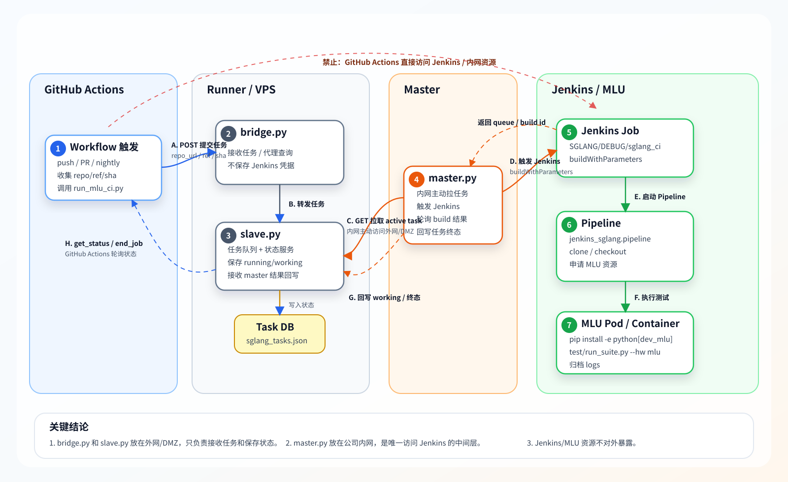

# SGLang MLU CI 消息流示意图

本文用一张静态图片展示 SGLang MLU CI 中 GitHub Actions、Runner/VPS、Master、Jenkins 之间的通信关系和消息流。图片不依赖 Mermaid 渲染，可以直接在 Markdown 预览、浏览器或 PPT 中使用。



## 消息流说明

| 序号 | 方向 | 消息 | 说明 |
| --- | --- | --- | --- |
| A | GitHub Actions -> bridge.py | `POST /` | 提交 CI 任务，包含 `repo_url`、`git_ref`、`commit_sha`、`trigger_type` |
| B | bridge.py -> slave.py | `POST /` | bridge 将任务转发给 slave，slave 生成并保存 `task_id` |
| C | master.py -> slave.py | `GET /source=master&aiming=get_data` | 内网 master 主动拉取 active task |
| D | master.py -> Jenkins | `POST buildWithParameters` | 触发 Jenkins job，传入代码版本和 `task_id` |
| E | Jenkins Job -> Pipeline | 启动 pipeline | Jenkins 按 `jenkins_sglang.pipeline` 执行 CI 流程 |
| F | Pipeline -> MLU Pod | 容器调度和测试 | 拉起 MLU 容器，安装依赖，执行 `test/run_suite.py --hw mlu` |
| G | master.py -> slave.py | `POST /` | 写回 `working`、`success`、`*_fail`、`error` 等状态，并追加 Jenkins 增量日志 |
| H | GitHub Actions -> bridge.py | `GET get_status` / `GET get_log` / `GET end_job` | GitHub Actions 轮询最终状态，下载完整日志并清理任务 |

## 通信边界

- GitHub Actions 只访问外网/DMZ 的 `bridge.py`。
- `bridge.py` 只和 `slave.py` 通信，不访问 Jenkins。
- `slave.py` 保存任务、状态和按 task id 归档的 Jenkins 完整日志，不保存 Jenkins 凭据。
- `master.py` 部署在内网，主动访问 `slave.py` 并触发 Jenkins。
- Jenkins 和 MLU 资源只在内网访问，不暴露给 GitHub Actions。

## 一句话总结

```text
GitHub Actions 把任务交给外网 Runner/VPS；Runner/VPS 只保存任务和状态；
内网 master 主动拉任务并触发 Jenkins；Jenkins 在内网 MLU 环境完成测试；
结果和 Jenkins 日志再沿 slave/bridge 回传给 GitHub Actions。
```


## 完整日志回传策略

完整 Jenkins 日志不放在 `get_status` 响应中，避免 GitHub Actions 轮询时重复传输大日志。推荐拆成两类接口：

| 接口 | 用途 | 返回内容 |
| --- | --- | --- |
| `get_status` | 高频轮询 | CI 状态、日志同步状态、Jenkins build id、最近日志摘要 |
| `get_log` | 任务结束后下载 | 完整 Jenkins console log，或 `tail=N` 指定的最后 N 行 |

CI 状态和日志同步状态是两个独立字段：`status` 表示测试结果，`log_status` 表示完整日志是否同步完成。即使 `log_status=failed`，master 也会尽量把最终 `status` 回传给 slave，避免大日志传输失败阻塞 GitHub Actions 获取 CI 结果。

GitHub Actions 侧固定策略：

| 结果 | 处理方式 |
| --- | --- |
| `success` | 下载完整 Jenkins 日志并上传 artifact，不在页面打印完整日志 |
| 非 `success` | 下载完整 Jenkins 日志并上传 artifact，同时打印最近 N 行日志 |

这样成功任务不会刷屏，失败任务能在 Actions 页面直接看到关键上下文，同时所有任务都有完整日志 artifact 可下载。
如果完整日志下载失败，GitHub Actions 会重试 3 次；仍失败时不调用 `end_job`，让远端任务和日志保留到 retention 自动清理，便于后续手动重试下载。
如果 `get_status` 返回 `log_status=failed`，Actions 应提示 `log_error`，并把已上传的日志 artifact 视为可能不完整。
